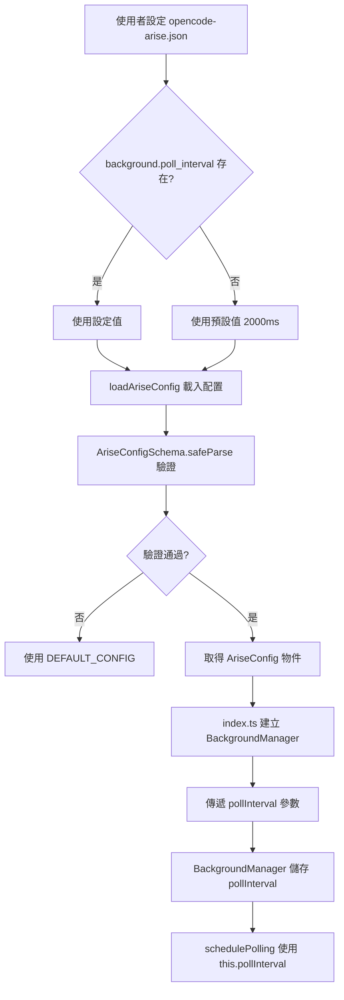

# Background Poll Interval 重構說明
# Background Poll Interval Refactoring Documentation

## 概述 / Overview

本次重構將 [`BackgroundManager`](src/tools/background-manager.ts:17) 類別中硬編碼的輪詢間隔（2 秒）改為可透過配置檔案設定的值。

This refactoring changes the hardcoded polling interval (2 seconds) in the `BackgroundManager` class to a configurable value via the configuration file.

---

## 問題 / Problem

### 重構前 / Before

[`src/tools/background-manager.ts:79`](src/tools/background-manager.ts:79) 中的 `schedulePolling` 方法使用硬編碼的值：

```typescript
private schedulePolling(taskId: string): void {
  setTimeout(() => this.pollTaskCompletion(taskId), 2000); // 固定 2 秒
}
```

這導致：
- 無法根據不同環境調整輪詢頻率
- 若 API 有 rate limit 限制，無法動態調整
- 測試困難，難以驗證不同間隔的行為

---

## 解決方案 / Solution

### 流程圖 / Flowchart



---

## 修改的檔案 / Modified Files

### 1. [`src/config/schema.ts`](src/config/schema.ts:46)

新增 `background.poll_interval` 設定綱要：

```typescript
background: z
  .object({
    poll_interval: z.number().default(2000),
  })
  .optional(),
```

### 2. [`src/config/schema.ts:63`](src/config/schema.ts:63)

新增預設配置：

```typescript
background: {
  poll_interval: 2000,
},
```

### 3. [`src/tools/background-manager.ts:17-25`](src/tools/background-manager.ts:17)

修改 `BackgroundManager` 建構函式：

```typescript
export class BackgroundManager {
  private pollInterval: number;

  constructor(ctx: PluginInput, pollInterval: number = 2000) {
    this.ctx = ctx;
    this.pollInterval = pollInterval;
  }
}
```

### 4. [`src/tools/background-manager.ts:78`](src/tools/background-manager.ts:78)

修改 `schedulePolling` 方法：

```typescript
private schedulePolling(taskId: string): void {
  setTimeout(() => this.pollTaskCompletion(taskId), this.pollInterval);
}
```

### 5. [`src/index.ts:79-82`](src/index.ts:79)

傳遞配置值給 `BackgroundManager`：

```typescript
const backgroundManager = new BackgroundManager(
  ctx,
  config.background?.poll_interval ?? 2000
);
```

---

## 使用方式 / Usage

在 `opencode-arise.json` 中設定輪詢間隔：

```json
{
  "background": {
    "poll_interval": 5000
  }
}
```

### 參數說明 / Parameter Description

| 參數 | 類型 | 預設值 | 說明 |
|------|------|--------|------|
| `poll_interval` | `number` | `2000` | 輪詢間隔（毫秒）|

### 建議值 / Recommended Values

| 情境 | 建議值 | 說明 |
|------|--------|------|
| 預設 | `2000` | 2 秒輪詢一次 |
| API rate limit 緊張 | `5000` | 5 秒輪詢一次，降低 API 負擔 |
| 需要快速反應 | `1000` | 1 秒輪詢一次 |

---

## 架構說明 / Architecture

```
┌─────────────────────────────────────────────────────────────┐
│                      opencode-arise.json                    │
└─────────────────────────────────────────────────────────────┘
                              │
                              ▼
┌─────────────────────────────────────────────────────────────┐
│                      loadAriseConfig()                       │
│                     (src/index.ts:26)                        │
└─────────────────────────────────────────────────────────────┘
                              │
                              ▼
┌─────────────────────────────────────────────────────────────┐
│                   AriseConfigSchema                         │
│                   (src/config/schema.ts:27)                  │
│  ┌─────────────────────────────────────────────────────┐    │
│  │  background: {                                       │    │
│  │    poll_interval: z.number().default(2000)          │    │
│  │  }                                                   │    │
│  └─────────────────────────────────────────────────────┘    │
└─────────────────────────────────────────────────────────────┘
                              │
                              ▼
┌─────────────────────────────────────────────────────────────┐
│                      OpencodeArise Plugin                    │
│                      (src/index.ts:76)                       │
└─────────────────────────────────────────────────────────────┘
                              │
                              ▼
┌─────────────────────────────────────────────────────────────┐
│                   BackgroundManager                         │
│                   (src/tools/background-manager.ts:17)      │
│  ┌─────────────────────────────────────────────────────┐    │
│  │  constructor(ctx, pollInterval = 2000)             │    │
│  │  private pollInterval: number                       │    │
│  └─────────────────────────────────────────────────────┘    │
└─────────────────────────────────────────────────────────────┘
                              │
                              ▼
┌─────────────────────────────────────────────────────────────┐
│                   schedulePolling(taskId)                   │
│                   (src/tools/background-manager.ts:78)       │
│  ┌─────────────────────────────────────────────────────┐    │
│  │  setTimeout(..., this.pollInterval)                │    │
│  └─────────────────────────────────────────────────────┘    │
└─────────────────────────────────────────────────────────────┘
```

---

## 向後相容性 / Backward Compatibility

此變更完全向後相容：

- 若未設定 `background.poll_interval`，預設使用 `2000ms`
- 現有的 `opencode-arise.json` 無需修改即可繼續運作
- `BackgroundManager` 的第二個參數有預設值，直接呼叫時不需傳遞

---

## 相關檔案 / Related Files

- [`src/tools/background-manager.ts`](src/tools/background-manager.ts) - Background manager 實作
- [`src/config/schema.ts`](src/config/schema.ts) - 配置 schema 定義
- [`src/index.ts`](src/index.ts) - 插件主入口
