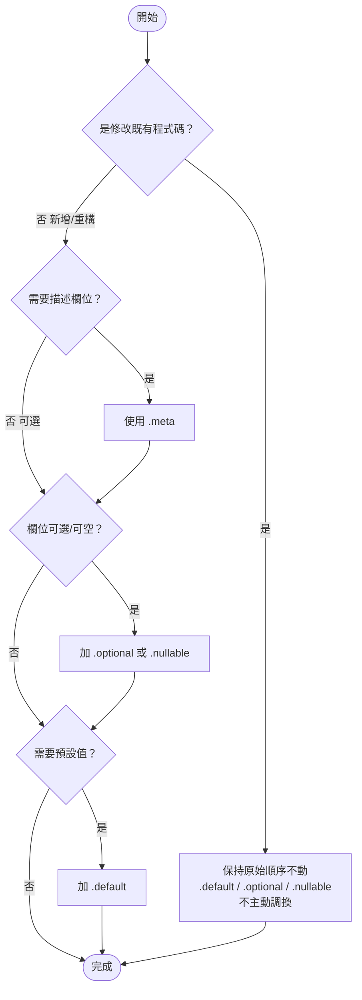

# Zod 語法鏈結順序規則
# Zod Method Chaining Order Rules

## 概述

定義 Zod Schema 方法鏈結的標準順序，確保程式碼一致性與可讀性。

Defines the standard order for Zod Schema method chaining to ensure code consistency and readability.

---

## 鏈結順序

```
z.類型() → .describe()/.meta() → .optional()/.nullable() → .default()
```

| 順序 | 類型 | 方法 | 說明 |
|------|------|------|------|
| 1 | **類型定義** | `z.string()`, `z.boolean()`, `z.object({...})` 等 | Schema 基礎類型 |
| 2 | **描述性方法** | `.describe("...")`, `.meta({...})` | 描述欄位用途與語義 |
| 3 | **可選修飾** | `.optional()`, `.nullable()` | 定義可選/可空 |
| 4 | **預設值** | `.default(value)` | 定義預設值 |

---

## 決策流程



### 流程圖說明

| 節點 | 說明 |
|------|------|
| **是修改既有程式碼？** | 判斷是否為修改現有程式碼，若是則保持原始順序 |
| **需要描述欄位？** | 新增/重構時，優先使用 `.meta()` 描述欄位 |
| **欄位可選/可空？** | 判斷是否需要 `.optional()` 或 `.nullable()` |
| **需要預設值？** | 判斷是否需要 `.default(value)`，放在最後 |

---

## 規則一：描述性方法順序（嚴格）

**`.describe()` 必須在 `.meta()` 之前。**

當兩者同時出現時，不可調換。

```typescript
// ✅ 正確：.describe 在 .meta 之前
level: z.enum(ALLOWED_LOG_LEVELS)
	.describe("日誌級別 / Log level")
	.meta({
		description: "日誌級別：error、warn、info、debug",
		title: "Level",
	}),

// ❌ 錯誤：.meta 在 .describe 之前
level: z.enum(ALLOWED_LOG_LEVELS)
	.meta({
		description: "日誌級別：error、warn、info、debug",
		title: "Level",
	})
	.describe("日誌級別 / Log level"),
```

### 推薦：僅使用 .meta

新增或重構時，推薦使用 `.meta()` 而非 `.describe()`：

```typescript
// ✅ 推薦：使用 .meta
enabled: z.boolean()
	.meta({
		description: "是否啟用 / Enable",
		title: "Enabled",
	}),

// ⚠️ 可接受但不推薦：使用 .describe
enabled: z.boolean()
	.describe("是否啟用 / Enable"),
```

---

## 規則二：值修飾方法順序（保持原始順序）

**`.default()`、`.optional()`、`.nullable()` 相鄰時，以原始順序為準，不主動變更。**

除非使用者明確指示或許可，否則不調換這些方法的順序。

```typescript
// ✅ 原始順序為 .default → .optional，保持不動
show_banner: z.boolean()
	.meta({
		description: "是否顯示橫幅",
	})
	.default(true).optional(),

// ✅ 原始順序為 .optional → .default，同樣保持不動
// （不主動改為 .default → .optional）
field: z.string()
	.optional().default("fallback"),
```

### 新增時的推薦順序

僅在**新增欄位或重構**時，推薦使用以下順序：

```
.describe() → .meta() → .optional() → .nullable() → .default()
```

```typescript
// ✅ 新增欄位時推薦的完整順序
new_field: z.string()
	.meta({
		description: "新欄位 / New field",
		title: "New Field",
	}).optional().default("value"),
```

---

## 正確範例

```typescript
// ✅ 類型 → .meta → .default（無 .optional/.nullable）
poll_interval: z.number()
	.meta({
		description: "輪詢間隔（毫秒）/ Polling interval in ms",
		title: "Poll Interval",
	}).default(DEFAULT_POLL_INTERVAL),

// ✅ 類型 → .meta → .optional（無 .default）
disabled_shadows: z.array(ShadowName)
	.meta({
		description: "要停用的 Shadow Agents 列表",
		title: "Disabled Shadows",
	}).optional(),

// ✅ 新增時推薦：類型 → .meta → .optional → .default
show_banner: z.boolean()
	.meta({
		description: "是否顯示橫幅 / Show welcome banner",
		title: "Show Banner",
	}).optional().default(true),

// ✅ 類型 → .describe → .meta → .default
level: z.enum(ALLOWED_LOG_LEVELS)
	.describe("日誌級別 / Log level")
	.meta({
		description: "日誌級別：error、warn、info、debug",
		title: "Level",
	}).default(EnumLogLevel.Warn),
```

---

## 錯誤範例

```typescript
// ❌ 錯誤：.meta 在 .describe 之前
level: z.enum(ALLOWED_LOG_LEVELS)
	.meta({ description: "日誌級別" })
	.describe("日誌級別 / Log level"),

// ❌ 錯誤：描述性方法在值修飾方法之後
enabled: z.boolean()
	.default(false)
	.meta({
		description: "是否啟用 / Enable",
		title: "Enabled",
	}),
```

---

## 規則三：`.describe()` 語言規範（嚴格）

**`.describe()` 僅使用英文。雙語註解放在區塊註解中，不放入 `.describe()`。**

`.describe()` 的內容會進入 JSON Schema 和 OpenAPI 文件，應保持單一語言（英文）以確保一致性。雙語說明應使用區塊註解寫在 schema 屬性上方。

```typescript
// ✅ 正確：區塊註解雙語，.describe() 僅英文
export const GIT_SUMMARY_ARGS = {
	/** 顯示近期 commit 數量 / Number of recent commits to show */
	log_count: z
		.number()
		.describe("Number of recent commits to show (default: 5)")
		.optional()
		.default(5),
	/** 是否包含 diff --stat / Include diff --stat output */
	diff_stat: z
		.boolean()
		.meta({
			description: "Include diff --stat output (default: true)",
		})
		.optional()
		.default(true),
} as const;

// ❌ 錯誤：.describe() 使用雙語
log_count: z
	.number()
	.describe("顯示近期 commit 數量 / Number of recent commits to show (default: 5)")
	.optional()
	.default(5),

// ❌ 錯誤：缺少區塊註解
log_count: z
	.number()
	.describe("Number of recent commits to show (default: 5)")
	.optional()
	.default(5),
```

### 原因

| 位置 | 語言 | 原因 |
|------|------|------|
| 區塊註解 `/** ... */` | 雙語（中文 / English） | 給開發者閱讀，IDE 顯示 |
| `description` | 僅英文 | 進入 JSON Schema / API 文件，保持單一語言 |

---

## 快速參考

```
描述性方法順序（嚴格）：
  .describe() → .meta()

值修飾方法順序：
  已有程式碼：保持原始順序不動
  新增/重構：  .optional() → .nullable() → .default()

推薦模式：
  z.type()
    .meta({...})          // 描述（新增時優先用 .meta）
    .optional()           // 可選
    .default(value)       // 預設值
```
